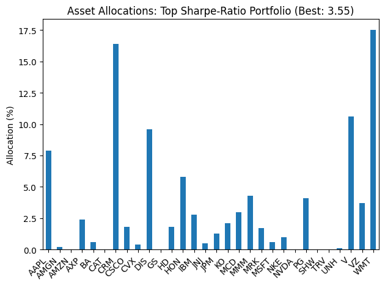
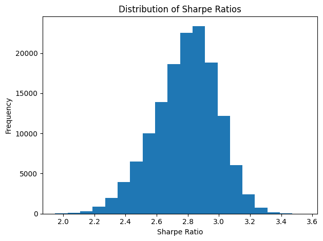

# Portfolio Optimization

This repository implements a portfolio optimizer on the Dow 30, finds the best Sharpe-ratio portfolios in sample (Aug – Dec 2024), and back-tests the winning portfolio on Q1 2025. It uses:

* **C#** (`App.Orchestrator`) for data loading, simulation and orchestration
* **F#** (`Library.Func`) for the pure math: returns, volatility, Sharpe, random weights, combinations
* **Python** (in `/data` and `/assets/graphs.ipynb`) for fetching Q1 2025 prices via AlphaVantage and graphing results

> **Note**: Parts of the code and this README were generated with help from ChatGPT and GitHub Copilot.

---

## Installation

1. Clone this repo:

   ```bash
   git clone https://github.com/PedroPertusi/portfolio-optimization.git
   cd portfolio-optimization
   ```

2. (Optional) Create a `.env` file at the root and add your AlphaVantage key:

   ```env
   ALPHAVANTAGE_API_KEY=your_api_key_here
   ```

   *You only need this if you want to re-fetch live data; the repo already includes CSVs so this step is not required to run.*

3. Build the projects:

   ```bash
   cd Library.Func
   dotnet build

   cd ../App.Orchestrator
   dotnet build
   ```

---

## How to Run

From the `App.Orchestrator` folder:

```bash
# default runs the in-sample optimization + Q1 2025 backtest
dotnet run
```

---

## Requirements & Dependencies

* [.NET 9.0 SDK](https://dotnet.microsoft.com/download)
* [F#](https://fsharp.org/) (bundled with .NET SDK)
* [Newtonsoft.Json](https://www.nuget.org/packages/Newtonsoft.Json)
* [DotNetEnv](https://www.nuget.org/packages/DotNetEnv)
* Python 3 (for the `/data/fetch_q1_2025.py` script)
* `pandas`, `requests` (in your Python environment for data fetch)

---

## Folder Structure

```
/
├─ App.Orchestrator/           # C# console app
│   ├─ DataLoader.cs           # EquityPrice + CSV/API loader
│   └─ Program.cs              # Simulation & backtest orchestration
│
├─ Library.Func/               # F# library
│   ├─ Helper.fs               # Pure math: returns, vol, Sharpe, combos
│   └─ Simulate.fs             # Monte-Carlo + combination search
│
├─ data/                       # CSVs & Python script
│   ├─ dow30.csv               # Saved 2024 price history
│   ├─ dow_jones_q1.csv        # Q1 2025 prices
│   └─ fetch_q1_2025.py        # Pulls Q1 2025 from yahoo finance
│
├─ results/                    # Outputs
│   ├─ bestPortfolios.csv      # One line per combination: “TICKER = xx.x%;…;Sharpe = x.xxx”
│   └─ results.txt             # Summary: best in-sample Sharpe, CSV line, Q1 2025 Sharpe
│
└─ assets/
    ├─ grafico1.png            # Bar chart of the best‐Sharpe portfolio allocations
    └─ grafico2.png            # Histogram of best Sharpe ratios across all combos
    └─ graphs.ipynb            # Jupyter notebook for graphing
```

---

## Expected Results & Comparisons

* **In-sample** (Aug 1 – Dec 31, 2024)

  * Finds the combination of 25 Dow 30 stocks with the highest Sharpe after 1,000 random-weight simulations each.
  * Writes **bestPortfolios.csv** (\~142,506 lines).
  * Logs the single best Sharpe and its CSV line to **results.txt**.

* **Out-of-sample** (Q1 2025)

  * Applies those in-sample weights to Q1 returns.
  * Computes Sharpe, cumulative and annualized returns, volatility.
  * Logs Q1 2025 Sharpe to **results.txt** for easy comparison.

---

## Graphs (/Results)
*Note: Graphs are generated in the Jupyter notebook `graphs.ipynb`. This are the graphs from the results in /results*


*Bar chart showing each ticker’s allocation in the top‐Sharpe portfolio.*


*Histogram of the best Sharpe ratios across all tested combinations.*

---

## Acknowledgements

* **The project was done in C# and F#, and the optional requirements implemented were Graphs, Q1 2025 testing and API data fetching.**
* Code scaffolding and README draft aided by **ChatGPT**.
* Snippets and inline editing assisted by **GitHub Copilot**.
* AlphaVantage for free historical data under API rate limits.

